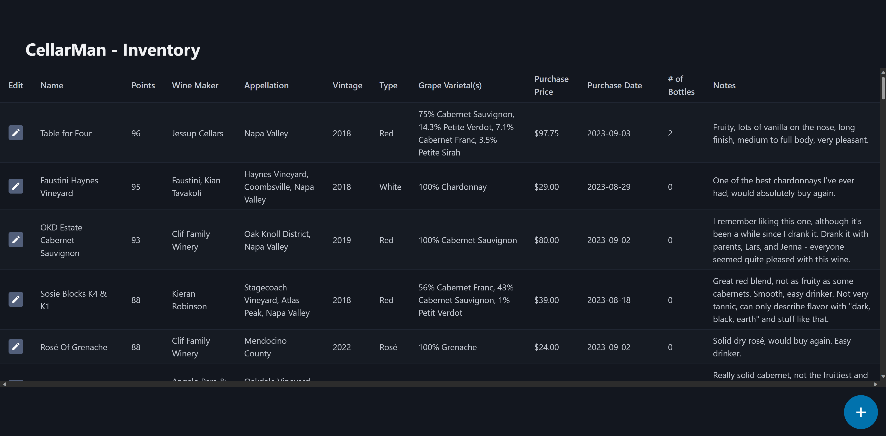
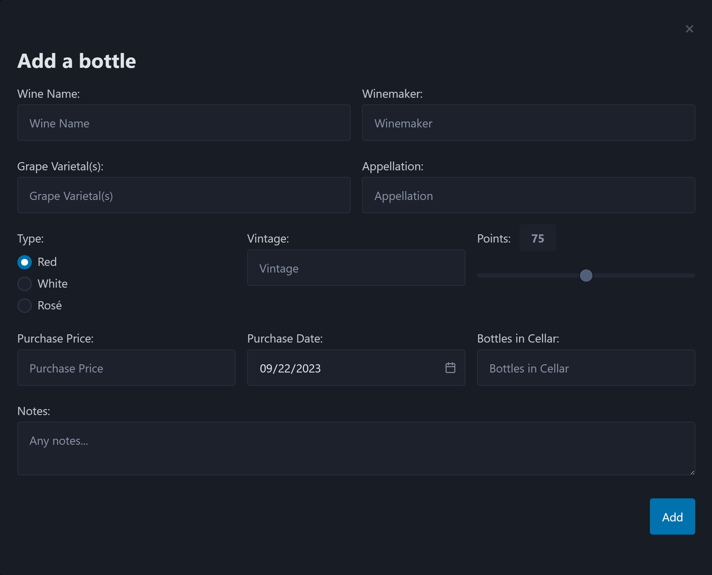
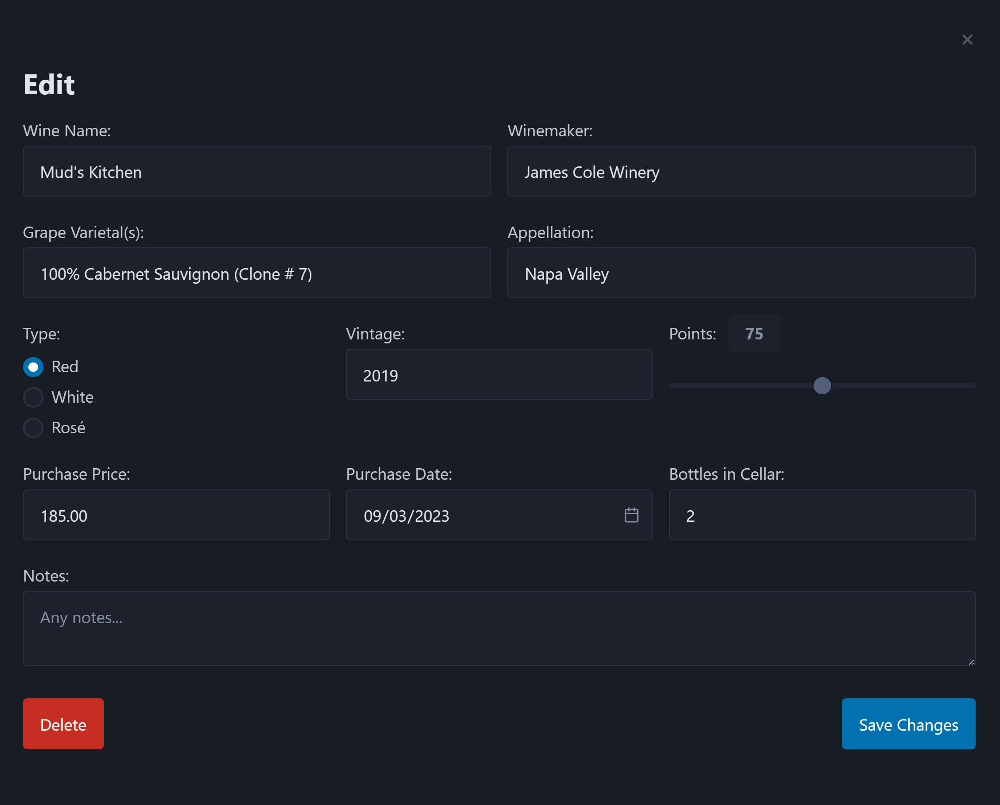

  

# CellarMan

An open source, self hosted wine cellar management and tracking application

## Installing/Running

1. Clone this repository
2. Edit the `ORIGIN` environment variable in your`docker-compose.yml` file to match the IP address or URL of your server
3. Create a `.env` file in the root folder of this app, and add `MONGO_URL=mongodb://db:27017/cellarman` to it
4. Run `docker-compose up -d` in a terminal

Ports are easily configurable in the `docker-compose.yml` file, default is 3000.

## Screenshots

### Main table view

### Add a bottle form

### Edit a bottle form

