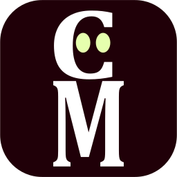

  

# CellarMan

An open source, self hosted wine cellar management and tracking application

## Installing/Running

1. Clone this repository
2. Edit the `ORIGIN` environment variable in your`docker-compose.yml` file to match the IP address or URL of your server
3. Create a `.env` file in the root folder of this app, and add `MONGO_URL=mongodb://db:27017/cellarman` to it
4. Run `docker-compose up -d` in a terminal

Ports are easily configurable in the `docker-compose.yml` file, default is 3000.

## Screenshots

### Main table view

### Add a bottle form

### Edit a bottle form

# License

MIT License

Copyright (c) 2023 Anders Olson

Permission is hereby granted, free of charge, to any person obtaining a copy
of this software and associated documentation files (the "Software"), to deal
in the Software without restriction, including without limitation the rights
to use, copy, modify, merge, publish, distribute, sublicense, and/or sell
copies of the Software, and to permit persons to whom the Software is
furnished to do so, subject to the following conditions:

The above copyright notice and this permission notice shall be included in all
copies or substantial portions of the Software.

THE SOFTWARE IS PROVIDED "AS IS", WITHOUT WARRANTY OF ANY KIND, EXPRESS OR
IMPLIED, INCLUDING BUT NOT LIMITED TO THE WARRANTIES OF MERCHANTABILITY,
FITNESS FOR A PARTICULAR PURPOSE AND NONINFRINGEMENT. IN NO EVENT SHALL THE
AUTHORS OR COPYRIGHT HOLDERS BE LIABLE FOR ANY CLAIM, DAMAGES OR OTHER
LIABILITY, WHETHER IN AN ACTION OF CONTRACT, TORT OR OTHERWISE, ARISING FROM,
OUT OF OR IN CONNECTION WITH THE SOFTWARE OR THE USE OR OTHER DEALINGS IN THE
SOFTWARE.
